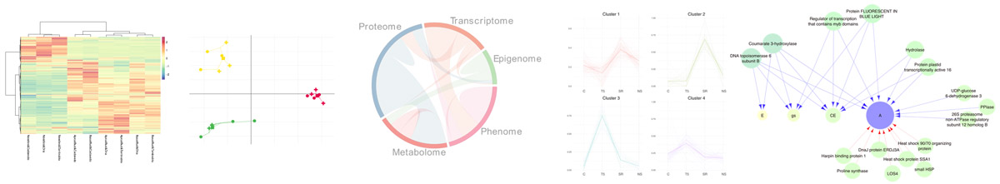

# pRocessomics
pRocessomics makes the integration of different omic levels easy

# Quick links
* [Valledor Lab Website](http://www.valledor.info/)
* [Processomics @ Valledor.info](http://processomics.valledor.info/)
* [Download package](/binary)
* [Wiki and case studies](/wiki)

# The problem
*"I love writing scripts for omic data processing and statistical analyses!"* -- no one, ever

**pRocessomics** is a simple but feature-rich pipeline for the statistical process of omics datasets. It was born out of the observation that this process is annoying and sometimes confusing; furthermore all the individual pieces of the process exist already but the available integrative solutions either don’t work, lack functions, are overly complicated or rely on non-free software. With **pRocessomics** you can perform state-of-the-art analyses done in less than 6 lines of code! And the best part is that you don’t almost even need to know R to use **pRocessomics** if you follow our detailed case studies and the information available in our [wiki](/wiki)

# Our approach
Our approach is based on performing a sequential analysis to juice our data.
* Stage 1, data pre-processing; Get our data ready to work with.
  * Missing value imputation
  * Abundance balancing
  * Data transformation
  * Filtering
* Stage 2, Univariate analysis; Classic approach.
  * Parametric (t-test, one and two ways ANOVAs, post hocs, ...)
  * Non-parametric (u-test, Kruskal-Wallis, post hocs, ...)
  * Distribution plots, boxplots, etc.
* Stage 3, Multivariate analysis; Reveal most relevant variables. Integrate different omic levels. Build meaningful networks.
  * PCA, ICA, DA, RF...
  * Integration of different omic levels (sPLS, MCIA, DIABLO)
  * Mapman and String
* Common features.
  * Sample subsetting based on feature selection
  * Easy vectorial and image exports
  * Tables can be exported in a ready-to-publish format
  * Some outputs are Cytoscape compatible

# About this document
This document started as internal draft. Some sections might not be clear, package is yet incomplete, bugs are expected, and a lot of features will be soon introduced. Please feel free  to open a GitHub issue.

# About the project
This project is currently under development. Help is very welcome.

Copyright 2019 Luis Valledor / Laura Lamelas

Licensed under the Apache License, Version 2.0 (the "License");
you may not use this file except in compliance with the License.
You may obtain a copy of the License at [Apache Foundation](http://www.apache.org/licenses/LICENSE-2.0)

Unless required by applicable law or agreed to in writing, software
distributed under the License is distributed on an "AS IS" BASIS,
WITHOUT WARRANTIES OR CONDITIONS OF ANY KIND, either express or implied.
See the License for the specific language governing permissions and
limitations under the License.
